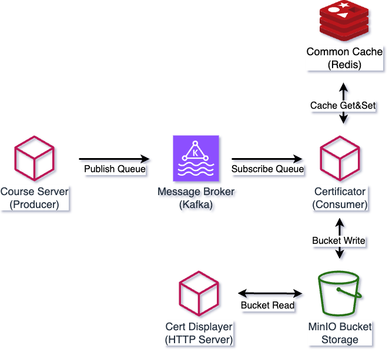

## BBK2023 Event Driven Architecture Certificate Service
Bu örnekte Kafka Redis Golang Gin webserver kurarak. Kullanıcılar kursları bitirince kurs sertifika isteği kafkaya gönderilecek ve kafka consumerları redis üzerinde exist kontrol ederek yeni sertifika oluşturup onu MinIO S3 Bucket Storage üzerine atacaklardır.  

## Architecture



### Requirements
- Docker
- Docker Compose
- Golang 1.20

### Clone Project  
```bash
# clean /root/workspace
cd /root/workspace
rm -rf /root/workspace/*
git clone https://github.com/AlperRehaYAZGAN/bbk23-event-driven-ms-demo.git
```


### Terminal 1
```bash
cd course-server-producer
source sample.env
go run main.go
```

### Terminal 2
```bash
cd certificator-consumer
source sample.env
go run main.go
```

### Terminal 3
```bash
cd certificate-displayer
source sample.env
go run main.go
```

### Terminal 4
```bash
# curl to course server
curl -X GET http://localhost:8086/user/:user_id/course/completed
```
